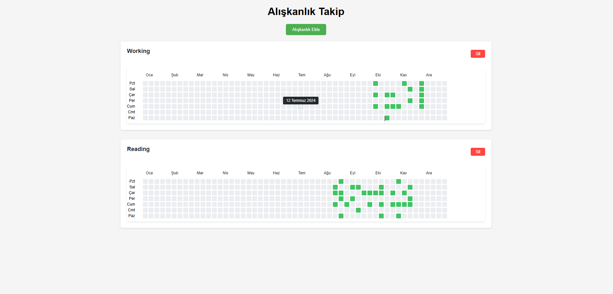

# Zinciri Kırma - Alışkanlık Takip Uygulaması

Bu uygulama, günlük alışkanlıklarınızı takip etmenize ve alışkanlık zincirlerinizi görselleştirmenize yardımcı olan bir web uygulamasıdır.

## Özellikler

- ✨ Yeni alışkanlık ekleme
- 📅 Yıllık takvim görünümü
- ✅ Günlük alışkanlık işaretleme
- 🗑️ Alışkanlık silme
- 📊 Görsel ilerleme takibi

## Kurulum

1. XAMPP'i bilgisayarınıza kurun
2. MySQL ve Apache servislerini başlatın
3. Projeyi `c:/xampp/htdocs/zinciri_kırma_v2` klasörüne kopyalayın
4. MySQL'de yeni bir veritabanı oluşturun:
   ```sql
   CREATE DATABASE zinciri_kırma_v2;
   ```
5. `database.sql` dosyasını içe aktarın:
   - PHPMyAdmin'e gidin
   - `zinciri_kırma_v2` veritabanını seçin
   - İçe Aktar sekmesini tıklayın
   - `database.sql` dosyasını seçin ve içe aktarın

## Kullanım

1. Tarayıcınızda `http://localhost/zinciri_kırma_v2` adresine gidin
2. "Alışkanlık Ekle" butonuna tıklayarak yeni alışkanlık ekleyin
3. Takvim üzerinde günleri tıklayarak alışkanlıklarınızı işaretleyin
4. Silmek istediğiniz alışkanlıkları "Sil" butonuyla kaldırın




## Teknik Detaylar

- Frontend: HTML, CSS, JavaScript
- Backend: PHP
- Veritabanı: MySQL
- Server: Apache (XAMPP)

## Veritabanı Yapısı

- `habits` tablosu: Alışkanlık bilgileri
  - id (int)
  - name (varchar)
  - created_at (timestamp)

- `habit_logs` tablosu: Alışkanlık kayıtları
  - id (int)
  - habit_id (int)
  - log_date (date)
  - created_at (timestamp)
